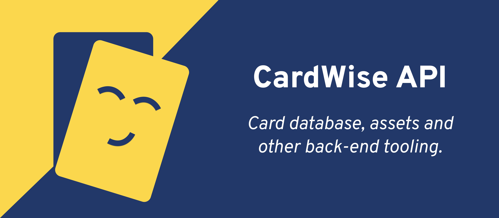

# API
[](https://github.com/cardwise-tcg/api/actions/workflows/test.yml)

API & other tools that make the [cardwise app and website](https://cardwise.itodorova.dev/) work. ^_^

<p align="center">

</p>

## Usage

- Base URL: `https://api.cardwise.itodorova.dev/`
- No tokens or authentication required

### Endpoints

#### Lorcana

##### Cards

###### Path: `/lorcana/cards`

###### Available filters

Filters are passed as query parameters, directly in the url. All parameters are optional and can be combined.

| Name      | Type                                                                                            | Description                            |
|-----------|-------------------------------------------------------------------------------------------------|----------------------------------------|
| `name`    | `string \| string[]`                                                                            | Card name, matches `%name%`            |
| `ink`     | [`Ink \| Ink[]`](https://github.com/cardwise-tcg/api/blob/main/src/http/lorcana/types/Card.ts)  | Ink color(s)                           |
| `set_key` | `string \| string[]`                                                                            | One or more `set_key`s                 |
| `type`    | [`CardTypes`](https://github.com/cardwise-tcg/api/blob/main/src/http/lorcana/types/Card.ts#L22) | Card type: Location, Character, etc... |


###### Response

<details>
  <summary><b>{ "cards": Card[] | CharacterCard[] }</b>></summary>

```json
{
    "cards": [
      {
        "artist": "Kendall Hale",
        "ink": "Amber",
        "ink_cost": 4,
        "inkable": true,
        "name": "Bashful",
        "types": [
          "Character"
        ],
        "rarity": "Uncommon",
        "number": 1,
        "keywords": [],
        "flavor_text": "Life is sweeter with friends.",
        "text": "Oh, Gosh!: This character can't quest unless you have another Seven Dwarfs character in play.",
        "classifications": [
          "Storyborn",
          "Ally",
          "Seven Dwarfs"
        ],
        "version": "Hopeless Romantic",
        "willpower": 5,
        "strength": 2,
        "lore": 3,
        "set": {
          "key": "rfb",
          "name": "Rise Of The Floodborn",
          "number": 2
        }
      }
    ]
}
```
</details>

###### Examples

Searching for `Stitch - Abomination` that is also a `Ruby` card:

```
https://api.cardwise.itodorova.dev/lorcana/cards?name=Stitch%20-%20Abomination&ink=Ruby
```

All cards from the second set `Rise of the Floodborn`:

```
https://api.cardwise.itodorova.dev/lorcana/cards?set_key=rfb
```

###### Images

Images for each card are available through a CDN hosted on Digital Ocean Spaces. To get the url of a card's image, use the following pattern:

```
https://cdn.cardwise.itodorova.dev/lorcana/{set_key}/{number}-{size}.png
```

Here is an example URL for the card `Stitch - Abomination`:

```
https://cdn.cardwise.itodorova.dev/lorcana/tfc/125-sm.png
```

_\* `125` is the number of the card in the set, also images come in three sizes `sm`, `md` & `lg`. Adjust the URL
accordingly._


## Contributions

If you found a mistake or want to add something to the project, feel free to open an issue or a pull request. I will be
happy to check it out! ^_^

For those unfamiliar with git (or github), I will soon prepare a simple guide on how to contribute to the project,
without having to download/install anything at all.

## Running it locally

### Requirements

- nodejs
- yarn

### Steps

1. Clone the repository
2. Run `yarn install` to install all dependencies
3. Run `yarn compile --with-lorcana` to compile Lorcana's data
4. Run `yarn dev` to start the server

[](https://www.digitalocean.com/?refcode=53147db54511&utm_campaign=Referral_Invite&utm_medium=Referral_Program&utm_source=badge)
